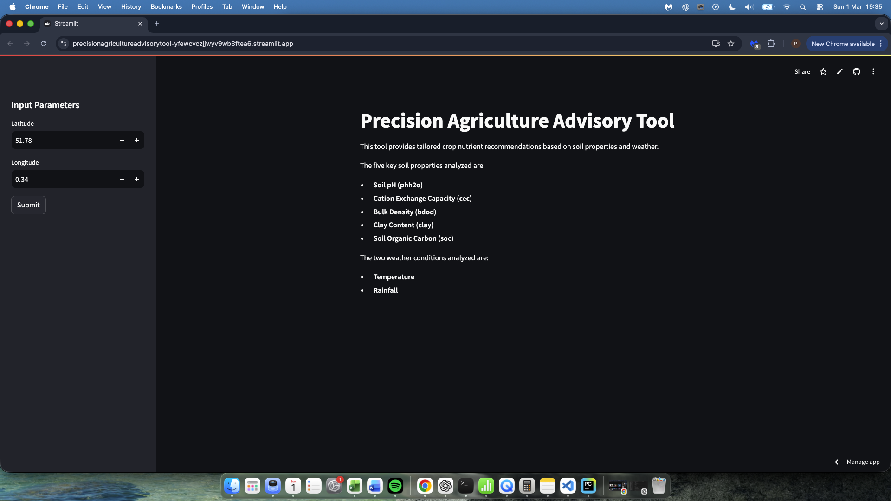
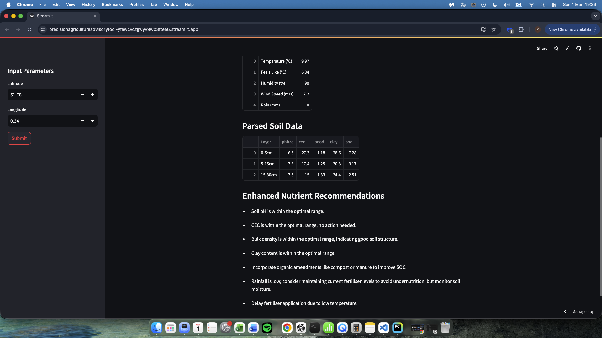

# Precision Agriculture Advisory Tool


A Streamlit web application that combines **soil** and **weather** data to provide **practical crop nutrition guidance**, supporting more efficient fertiliser use and sustainable decision-making.

**Live app:** `https://precisionagricultureadvisorytool-yfewcvczjjwyv9wb3ftea6.streamlit.app/`

## Contents
1. [Introduction](#introduction)
2. [Screenshots](#screenshots)
3. [Problem and motivation](#problem-and-motivation)
4. [End-to-end workflow](#end-to-end-workflow)
5. [Features](#features)
6. [Running locally](#running-locally)
7. [Configuration](#configuration)
8. [Usage](#usage)
9. [Deployment](#deployment)
10. [Technologies](#technologies)
11. [Limitations and future work](#limitations-and-future-work)
12. [License](#license)
13. [Contact](#contact)

## Introduction

Farmers and advisors often lack an integrated, quick tool to translate soil and weather signals into actionable nutrient decisions. This project bridges that gap by fetching soil properties (SoilGrids) and live weather (OpenWeather), processing them into interpretable values, and presenting practical recommendations in a simple interface.

## Screenshots

> Add screenshots to `assets/` and update the file names below if needed.

**Input sidebar and controls**


**Example outputs and recommendations**


## Problem and motivation

I built this tool to address common failures in nutrient management:

- **Economic:** wasted spend from over-application; yield loss from under-application.
- **Technical:** nutrient requirements vary by crop, soil type, and timing.
- **Environmental:** leaching and runoff (e.g., eutrophication) from inefficient application.

The guiding question is:

> How can farmers leverage data to optimise nutrient application effectively?

## End-to-end workflow

1. **Problem definition**  
   Define the user decision: “What should I apply, and when, given my soil and current conditions?”

2. **Data collection**  
   - Soil properties via **SoilGrids API**
   - Live weather via **OpenWeather API**
   - User inputs: location (lat/long) and crop/context

3. **Data processing**  
   Clean and standardise API responses, then compute derived fields used for recommendations.

   **SoilGrids scaling notes** (to align with common agronomy conventions):
   - `phh2o`: scaled by **0.1** to match the pH scale
   - `cec`: divided by **10** to convert to cmol/kg
   - `bdod`, `clay`, `soc`: used directly (units already interpretable)

4. **Analytics and recommendations**  
   Generate tailored guidance from soil + weather signals, presented as readable outputs.

5. **Delivery**  
   Streamlit UI for quick input → results → interpretation.

6. **Deployment**  
   Streamlit Community Cloud deployment for public access.

## Features

- **Soil analysis** (core properties)
  - pH (`phh2o`)
  - Cation exchange capacity (`cec`)
  - Bulk density (`bdod`)
  - Clay content (`clay`)
  - Soil organic carbon (`soc`)
- **Weather analysis**
  - Temperature
  - Rainfall / precipitation context
- **Recommendations**
  - Practical guidance based on soil + weather conditions
  - Notes for deficiencies, risk conditions, and timing considerations

## Running locally

### Requirements
- Python 3.7+
- An OpenWeather API key

### Install
```bash
git clone https://github.com/peterchiriac/Precision_Agriculture_Advisory_Tool.git
cd Precision_Agriculture_Advisory_Tool
pip install -r requirements.txt
```

## Run

streamlit run agri.py

After running, open the local URL Streamlit prints (typically http://localhost:8501).

## Configuration
Create a .env file in the project root:
```bash
OPENWEATHER_API_KEY=your_openweather_api_key
```

Usage
	1.	Enter latitude and longitude in the sidebar.
	2.	Click Submit to fetch soil and weather data.
	3.	Review:
	•	the processed soil/weather tables
	•	the recommendation outputs

Example locations (for convenience):

England
	•	Cambridge: 52.2053, 0.1218
	•	London outskirts: 51.5074, -0.1278
	•	Manchester area: 53.4808, -2.2426

Romania
	•	Bacău County: 46.5678, 27.6659

Indiana, US
	•	Indianapolis area: 39.7684, -86.1581

Note: These are examples only; use coordinates for your target field.

Deployment

Deployed on Streamlit Community Cloud:

https://precisionagricultureadvisorytool-yfewcvczjjwyv9wb3ftea6.streamlit.app/

## Technologies
| Technology | Purpose |
|---|---|
| Python | Core language |
| Streamlit | Web app |
| Pandas | Data processing |
| Requests | API calls |
| SoilGrids API | Soil properties |
| OpenWeather API | Weather data |

## Limitations and future work

Limitations
	•	Relies on third-party APIs; accuracy and availability depend on those services.
	•	Resolution varies by location and dataset coverage.
	•	No integrated map/location names (lat/long only).

Future work
	•	Unified recommendation summary (single action plan with priorities).
	•	Add visualisations (Matplotlib / Plotly).
	•	Integrate a location lookup/map view.
	•	Expand parameters and improve agronomy calibration.

## License

MIT — see LICENSE.

## Contact

For enquiries or feedback: peter.chiriac@outlook.com
